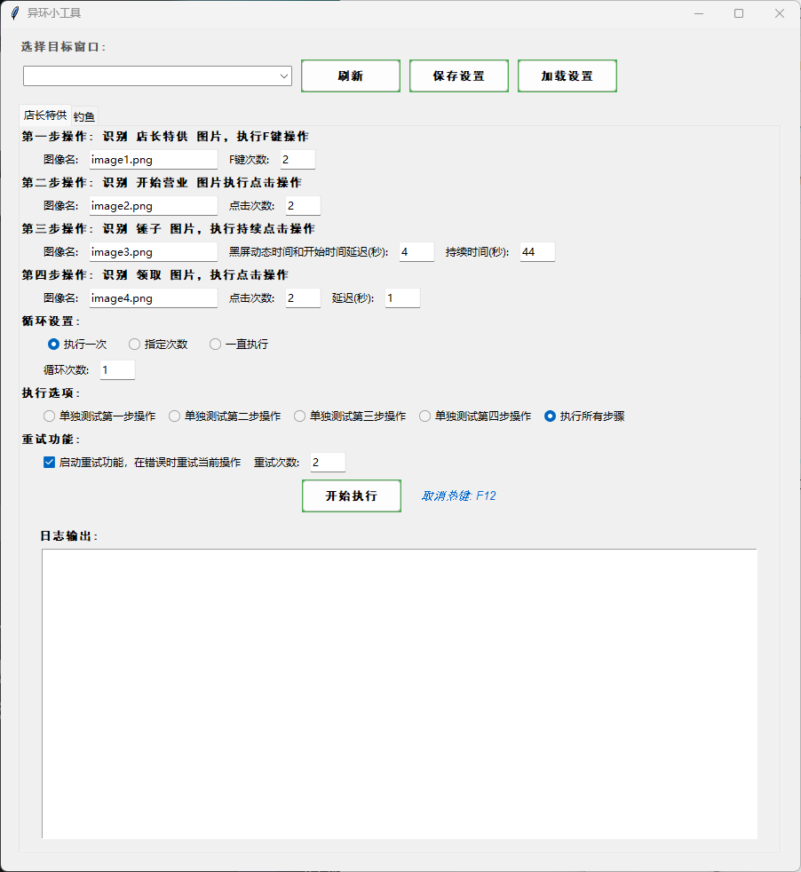
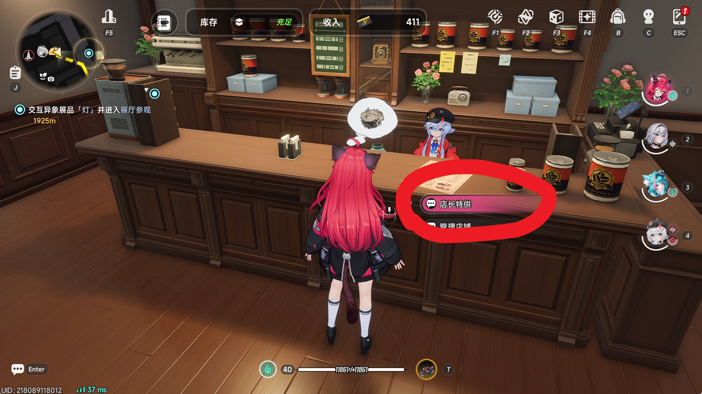
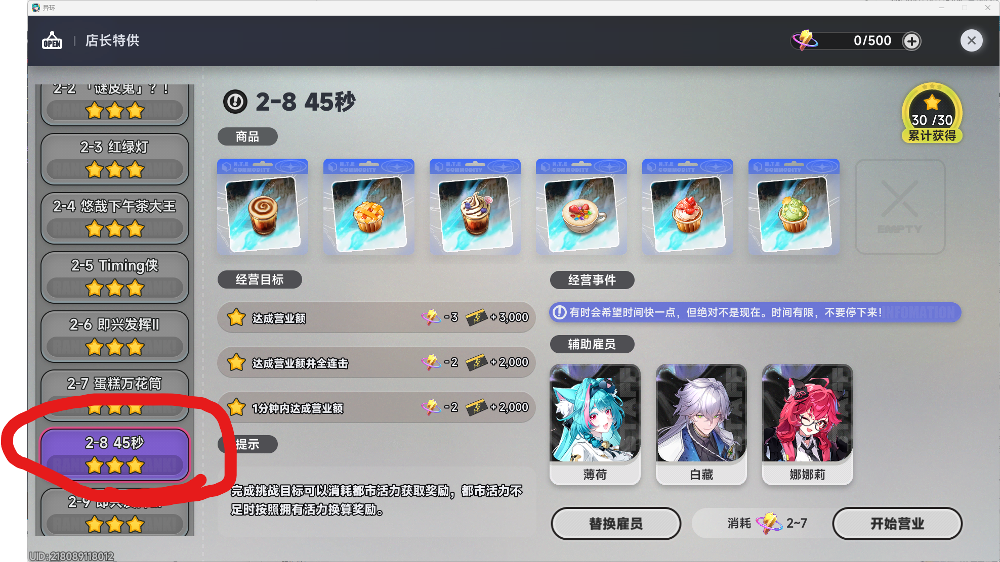
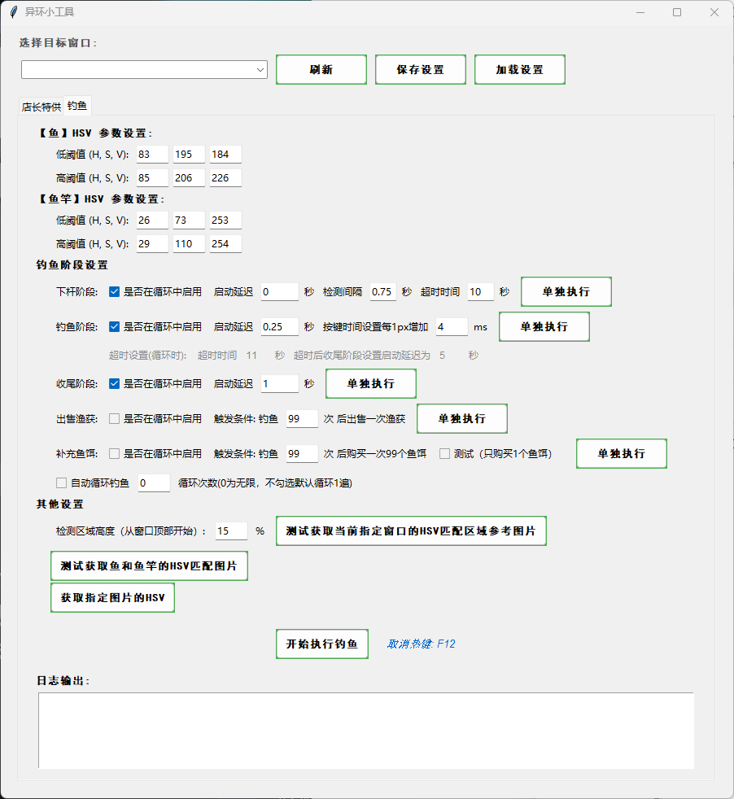

# 异环小工具

## 功能说明

这是一个由 Trae CN （AI）生成的带GUI界面的自动化工具，包含两个主要模块：

- **店长特供**：自动执行店长特供任务，包括识别图像并执行F键、点击等操作
- **钓鱼**：自动钓鱼功能，使用HSV颜色匹配识别鱼和鱼竿，实现自动下杆、钓鱼、收尾、出售渔获和补充鱼饵

## 版本信息

当前版本：**1.3.0.0**

## 安装步骤

### 方法1：使用已打包的可执行文件（推荐）

1. 直接以管理员运行 `异环小工具.exe` 文件
2. **注意**：图片资源已打包进 exe，无需手动添加图片文件
3. 下载链接：https://pan.quark.cn/s/31ef9bf94dbf

### 方法2：从源代码运行

1. 确保已安装Python 3.10+
2. 安装所需依赖包：

   ```bash
   pip install pygetwindow pyautogui opencv-python numpy keyboard
   ```

3. 安装完依赖后源码执行：
   ```bash
   python main.py
   ```

## 店长特供



### **店长特供 需要有 娜娜莉 和 白藏 ！！！**

### 功能介绍

自动执行店长特供任务，包含四个步骤：

1. 识别「店长特供」图片，执行F键操作
2. 识别「开始营业」图片，执行点击操作
3. 识别「锤子」图片，执行持续点击操作
4. 识别「领取」图片，执行点击操作

### 使用方法

1. **准备工作**：
   - 确保默认选择「店长特供」

   
   - 确保默认选中 2-8 关卡，没选中可以先进去玩一局

   

2. **GUI界面设置**：
   - **选择目标窗口**：从下拉列表中选择需要操作的窗口
   - **操作设置**：设置每步的参数
   - **循环设置**：选择执行次数（一次、指定次数、一直执行）
   - **执行选项**：选择要执行的操作（单个操作或所有步骤）
   - **重试功能**：启用在错误时重试当前操作

3. **开始执行**：
   - 点击"开始执行"按钮
   - 执行过程中可以按F12键取消操作

### 注意事项

- 必须以管理员权限运行
- 确保目标窗口可见，不能最小化或被遮挡
- 鼠标操作采用平滑移动方式，模拟真实操作

---

## 钓鱼



### 功能介绍

自动钓鱼功能，包含五个阶段：

1. **下杆阶段**：识别鱼的位置，按F键下杆
2. **钓鱼阶段**：实时识别鱼和鱼竿的位置，根据距离自动按键调整位置
3. **收尾阶段**：完成钓鱼后执行收尾操作
4. **出售渔获**：自动出售钓鱼获得的渔获（需要设置触发条件）
5. **补充鱼饵**：自动购买鱼饵（需要设置触发条件）

### 使用方法

1. **准备工作**：
   - 确保游戏处于钓鱼状态，然后点击开始执行就可以了

   
   - 调整好HSV颜色参数（已经测试过调好了，不喜欢可使用测试按钮获取参考值，然后自己调整）

2. **GUI界面设置**：
   - **选择目标窗口**：从下拉列表中选择游戏窗口
   - **HSV颜色设置**：
     - 鱼的HSV范围：设置识别鱼的颜色参数
     - 鱼竿的HSV范围：设置识别鱼竿（黄色竖线）的颜色参数
   - **检测区域高度**：设置检测区域占屏幕高度的百分比

3. **钓鱼阶段设置**：
   - **下杆阶段**：
     - 启用/禁用此阶段（勾选"是否在循环中启用"）
     - 设置延迟时间、间隔时间和超时时间
     - 点击"单独执行"可测试此阶段
   - **钓鱼阶段**：
     - 启用/禁用此阶段
     - 设置延迟时间
     - 按键时间设置（默认每1px 4ms）
     - 点击"单独执行"可测试此阶段
   - **收尾阶段**：
     - 启用/禁用此阶段
     - 设置延迟时间
     - 点击"单独执行"可测试此阶段
   - **出售渔获**：
     - 启用/禁用此阶段
     - 设置触发条件：钓鱼N次后出售一次渔获
     - 点击"单独执行"可测试此功能
   - **补充鱼饵**：
     - 启用/禁用此阶段
     - 设置触发条件：钓鱼N次后购买一次鱼饵
     - 测试模式：勾选后只购买1个鱼饵
     - 点击"单独执行"可测试此功能

4. **自动循环钓鱼**：
   - 勾选启用自动循环
   - 设置循环次数（0为无限循环，不勾选默认循环1遍）

5. **开始执行**：
   - 点击"开始执行钓鱼"按钮
   - 可以单独执行每个阶段进行测试
   - 执行过程中可以按F12键取消操作

### 出售渔获流程

出售渔获功能会自动执行以下操作：

1. 按Q键打开背包
2. 识别并点击「全部出售」按钮（image1-1.png）
3. 识别并点击「确认」按钮（image1-2.png）
4. 识别并点击「出售」按钮（image1-3.png）
5. 按ESC返回并确认返回钓鱼场景（image1-4.png）

### 补充鱼饵流程

补充鱼饵功能会自动执行以下操作：

1. 按R键打开商店
2. 识别并点击「鱼饵」按钮（image2-1.png）
3. 识别并点击「购买」按钮（image2-2.png）
4. 识别并点击「最大数量」按钮（image2-3.png，如不存在则跳过）
5. 按ESC返回并确认返回钓鱼场景（image2-4.png）

### HSV颜色参数设置

HSV（色相、饱和度、明度）是颜色识别的关键参数：

- **鱼的HSV**：根据游戏中鱼的颜色调整，建议在游戏中截取鱼的图片，使用"获取指定图片的HSV"功能获取参考值
- **鱼竿的HSV**：识别黄色竖线，建议范围：H:20-45, S:50-180, V:180-255

### 测试功能说明

- **测试获取鱼和鱼竿的HSV匹配图片**：截取当前窗口中匹配HSV范围的区域，保存到 `images/fishing_screenshots/` 文件夹
- **获取指定图片的HSV**：选择一张图片，获取其HSV最小值和最大值，用于设置颜色参数
- **测试获取当前窗口的HSV匹配区域参考图片**：保存匹配区域的截图，用于调试

### 注意事项

- **必须以管理员权限运行**：否则可能无法操作游戏窗口
- **确保目标窗口可见**：窗口不能最小化或被其他窗口遮挡
- **HSV参数调整**：不同游戏环境可能需要调整HSV参数以获得最佳识别效果
- **取消操作**：按下F12键可以立即取消正在执行的操作
- **全屏情况下**：需要先按 Win 键切出菜单，然后快速按 F12
- **性能影响**：钓鱼操作可能会占用较多系统资源，建议关闭其他占用资源的程序
- **分辨率适配**：出售渔获和补充鱼饵功能支持不同分辨率，会自动缩放模板图片

---

## 全局注意事项

- **取消热键（F12）**：全局取消热键，执行过程中按F12可取消操作
- **管理员权限**：必须以管理员权限运行，否则可能无法正常操作
- **窗口激活**：执行操作前会自动激活目标窗口
- **日志输出**：每个模块有独立的日志输出区域，便于查看执行状态
- **设置保存**：点击"保存设置"按钮可保存当前配置，下次启动自动加载

## 故障排除

- **键盘操作无反应**：确保以管理员权限运行，检查目标窗口是否在前台
- **窗口列表为空**：点击"刷新窗口列表"按钮，确保目标窗口已打开
- **图像识别失败**：检查图像文件是否存在（打包版本无需手动添加），调整HSV参数或匹配阈值
- **取消热键不工作**：确保工具以管理员权限运行，检查F12键是否被其他程序占用
- **钓鱼识别异常**：调整HSV参数，确保游戏画面中鱼和鱼竿清晰可见
- **出售渔获/补充鱼饵失败**：确保游戏处于正确的场景，检查模板图片识别是否正常

## 更新日志

### v1.3.0.0

- **钓鱼核心逻辑重构**：A/D键改为状态跟踪保持按下，而非按下后立即释放
- **钓鱼阶段失败判定优化**：首次检测失败判定为失败，后续检测失败判定为正常结束
- **修复店长特供模块**：解决重复提示的问题
- **修复钓鱼模块UI卡住**：单独执行各阶段时界面不再卡住
- **新增日志格式统一**：统一钓鱼阶段的日志格式，每秒打印一次
- **新增标签页高度自适应**：切换不同模块时自动调整窗口高度

### v1.2.0.5

- 优化补充鱼饵流程，拆分为多个步骤
- 新增 image2-1-1.png 和 image2-1-2.png 模板图片支持
- 增强日志输出，明确标注各步骤操作

### v1.2.0.4

- 修复钓鱼模块中get_image_hsv方法的图片读取问题
- 修复中文路径下模板图片无法读取的问题
- 统一修复所有模块的图片读取方式

### v1.2.0.3

- 新增出售渔获功能，支持自动出售钓鱼获得的渔获
- 新增补充鱼饵功能，支持自动购买鱼饵
- 优化GUI布局，将出售渔获和补充鱼饵整合到钓鱼阶段设置中
- 支持不同分辨率的模板匹配，自动缩放模板图片
- 修复中文路径图片读取问题
- 优化打包配置，图片资源自动打包进exe

### v1.1.0.0

- 优化钓鱼阶段的延迟设置
- 修复HSV颜色匹配问题
- 增加更多调试信息

### v1.0.0.0

- 初始版本
- 包含店长特供和钓鱼两个模块
- 支持HSV颜色识别
- 支持自动循环钓鱼
